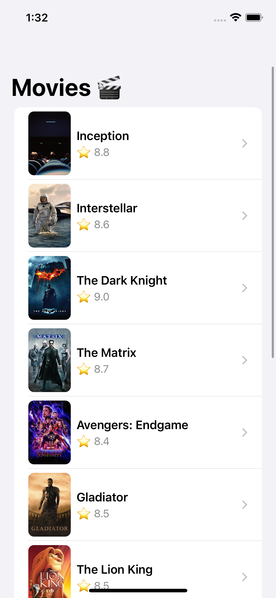
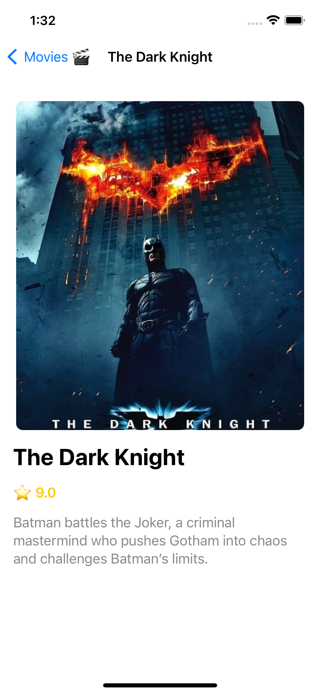

# 🎬 Movie Browser App

An iOS app built with **SwiftUI + UIKit + MVVM architecture**.  
Data is served via a **Mockoon local API** for testing.  

## ✨ Features
- Browse list of movies  
- Movie detail screen with poster, rating & description  
- Local mock API using Mockoon  
- Clean MVVM architecture  
- SwiftUI + UIKit integration  
- Unit Tests for networking & ViewModels  

## 🛠️ Tech Stack
- Swift 5.0
- SwiftUI & UIKit
- MVVM Architecture
- Async/Await Networking
- Mockoon (local mock API)
- XCTest (Unit + ViewModel Tests)

## 🚀 Getting Started
1. Clone this repo
2. Install [Mockoon](https://mockoon.com/)
3. Run `movies.json` API locally (`http://localhost:3000/movies`)
4. Open `LocFlix.xcodeproj` in Xcode
5. Run on Simulator

## 📸 Screenshots

### Home Screen

### Movie Details

### Demo (VIDEO)

---
